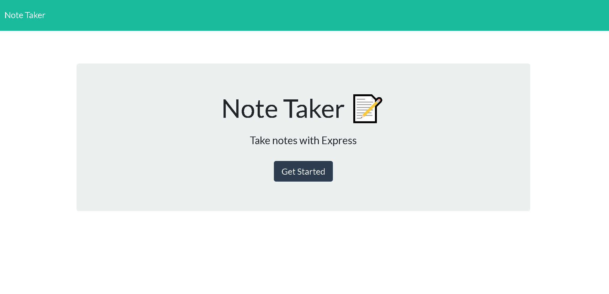

#  crazynotes Note Taker  

 

  

 

## Description

Crazynotes is this application that can be used to write and save notes. This application uses Express.js back end and will save and retrieve note data from a JSON file.

## Table of Contents 

- [Description](#description)
- [Usage](#usage)
- [Deployed](#deployedapplicationlink)
- [Languages](#languages)
- [Screenshot](#screenshot)
- [License](#license)
- [Questions](#questions)

 
 

## Usage

Users will enjoy using this application to be able to write and save notes
so that you can organize your day notes to keep track of anything.  

## Deployed application link

https://radiant-brook-87611.herokuapp.com/

## Screenshot

    

  

    

  

## Languages

- JavaScript
- Express.js
- Heroku
- JSON
- Node

 

## License

This project is licensed under the MIT license.  
  

## Questions?

If you have any questions at all about the project, you can contact me at: 
toni.huertinez@gmail.com  
Check out more of my work at: 
[AntonioHuerta](https://github.com/Tonycodesnow) 
